# Introduction

Student loan debt (SLD) total in the US reached a staggering number in 1.5 trillion dollars, borrowed by 44 million people. It is 2.4 times larger than the total of credit card debt.  The SLD total in 2008 was 640 billion dollars [which ballooned to 1.2 trillion by 2015](https://www.politifact.com/truth-o-meter/statements/2015/aug/14/jeb-bush/jeb-bush-student-loan-debt-has-doubled-under-obama/).  

While [the return on investment of higher education (HED) is well known and documented](https://college-education.procon.org/), student loans accumulated for financing higher education are reported as societal issues such as [reasons for divorce](https://www.yahoo.com/amphtml/finance/news/millennial-marriages-crumbling-student-loan-debt-134145853.html), financial dependence on parents, and lack of home ownership amongst Gen-Y.  

In order for a student to be able to pay off HED loans, the loan total should not exceed his/her annual income from gainful employment the HED would provide.  For unfortunate some, this rule of thumb was violated and loan defaults resulted. 

The US Department of Education publishes the College Scorecard data to help the public to make informed decisions about investments in higher education.  The data features large amount of metrics including default rates and is organized by academic year. In this report, we will focus on the 2014-15 scorecard data to achieve the following objectives:

- Explore in order to ascertain correlations the data is telling us. 
- Find out strong predictors influencing the default rates.
- Build a predictive model for the default rates.


***

# Data Load

The data set is a part of a [data bundle](https://ed-public-download.app.cloud.gov/downloads/CollegeScorecard_Raw_Data.zip) published by the US Department of Education.  This analysis utilizes the data pertinent to the 2014-15 year (`MERGED2014_15_PP.csv`). The full data documentation is found [here](https://collegescorecard.ed.gov/assets/FullDataDocumentation.pdf).

While it is labeled 2014-15, the data set reports the 2012 cohort for loan repayment tracking purposes. The cohort is defined as the group whose members entered repayment between October 2011 and September 2012 (FY2012), and went into a default status by September 2014.  


```r
# Load the college scorecard data set for academic year 14-15

scorecard1415 <- read.csv("MERGED2014_15_PP.csv",na.strings=c("NULL","PrivacySuppressed"))
scorecard1415 <- tbl_df(scorecard1415) # converting to a tibble
```

***
# Data Wrangling

Clean up and tidy the data set for exploratory data analysis and modeling.

- Select variables relevant to this study.
- Inspect presence of missing value.
- Determin missing value treatment strategy if applicable.
- Transform data types appropriately.

## Select Relevant Variables 

Two issues are noticed immediately. 

1. The number of variables/features is overwhelmingly large at 1700+.
2. Many observations/rows have missing values. 

To address the first issue, the [data element list](https://collegescorecard.ed.gov/assets/CollegeScorecardDataDictionary.xlsx) has been reviewed. Using the [data documentation](https://collegescorecard.ed.gov/assets/FullDataDocumentation.pdf) as guideline, the variables are selected.


```r
sc1415.all <- scorecard1415 %>% select(OPEID6,INSTNM,STABBR,NUMBRANCH,CONTROL,PREDDEG,
                               REGION,LOCALE,LATITUDE,LONGITUDE,CCBASIC,
                               CCUGPROF,CCSIZSET,RELAFFIL,ADM_RATE_ALL,DISTANCEONLY,UGDS,
                               CURROPER,NPT4_PUB,NPT4_PRIV,NUM4_PUB,NUM4_PRIV,TUITFTE,INEXPFTE,
                               AVGFACSAL,PFTFAC,PCTPELL,C150_4,RET_FT4,PCTFLOAN,UG25ABV,
                               CDR2,CDR3,PAR_ED_PCT_1STGEN,DEP_INC_AVG,IND_INC_AVG,
                               DEBT_MDN,GRAD_DEBT_MDN,WDRAW_DEBT_MDN,FAMINC,MD_FAMINC,POVERTY_RATE,
                               MN_EARN_WNE_P10,MD_EARN_WNE_P10,CDR3_DENOM)
```

The column names are kept as provided in the data set. In the modeling section, the names of the columns selected as strong predictors will be described. 

The `CDR3` column reports the average default rates of the students who entered repayment in FY2012 and defaulted within the tracking period (October 2011 through September 2014). Hence, the observations with missing values in the column cannot be used for this analysis.  They are removed. 


```r
sc1415 <- sc1415.all %>% filter(!is.na(CDR3))
```

As for missing values, it's observed that they are rather concentrated on the schools classified as stand alone graduate institution. Let's remove them from the data frame.


```r
sc1415 <- sc1415 %>% filter(PREDDEG!=4)
```

## Missing Values

After graduates schools are removed, are there any columns with missing values?  


```r
names(sc1415)[colSums(is.na(sc1415))>0]
```

```
##  [1] "LOCALE"            "LATITUDE"          "LONGITUDE"        
##  [4] "CCBASIC"           "CCUGPROF"          "CCSIZSET"         
##  [7] "RELAFFIL"          "ADM_RATE_ALL"      "DISTANCEONLY"     
## [10] "UGDS"              "CURROPER"          "NPT4_PUB"         
## [13] "NPT4_PRIV"         "NUM4_PUB"          "NUM4_PRIV"        
## [16] "TUITFTE"           "INEXPFTE"          "AVGFACSAL"        
## [19] "PFTFAC"            "PCTPELL"           "C150_4"           
## [22] "RET_FT4"           "PCTFLOAN"          "UG25ABV"          
## [25] "CDR2"              "PAR_ED_PCT_1STGEN" "DEP_INC_AVG"      
## [28] "IND_INC_AVG"       "DEBT_MDN"          "GRAD_DEBT_MDN"    
## [31] "WDRAW_DEBT_MDN"    "FAMINC"            "MD_FAMINC"        
## [34] "POVERTY_RATE"      "MN_EARN_WNE_P10"   "MD_EARN_WNE_P10"
```

Yes, 36 of 45 columns still have missing values.  Let's compute their proportions and select those under 10%.


```r
naProportion <- apply(sc1415,2,function(x){sum(is.na(x))/nrow(sc1415)})
naProportion <- naProportion[naProportion<.1]
```

Let's confirm that all `CDR3` (default rate) and `CDR3_DENOM` (the number of students in the FY2012  cohort, i.e. the denominator in the default rate calculation) values are numeric.


```r
!is.numeric(sc1415$CDR3)
```

```
## [1] FALSE
```

```r
!is.numeric(sc1415$CDR3_DENOM)
```

```
## [1] FALSE
```

## Variable Selection

Now select the variables with less than 10% missing value. Further clean up by eliminating the rows with missing values (Caveat: This is a simpliest approach of treating missing values.  This may have to be revisited in pursuit of a more efficient strategy.)


```r
selectedCols <- names(naProportion)
sc1415 <- sc1415[,selectedCols]

sc1415.net <- sc1415[complete.cases(sc1415),]  # remove rows with missing values in selected columns.

names(sc1415)[colSums(is.na(sc1415.net))>0]
```

```
## character(0)
```

The total number of rows has reduced from 6423 to 5209 and the number of columns is down to 23.  
The summary statistics of default rates (`CDR3`) are comparable amongst the three data sets -- with graduate schools present, without grad schools, and without missing values.  We will move ahead with the the `sc1415.net` data frame for the analysis.  Please note that unclassified institutions (`PREDDEG = 0`) have been removed at the missing-value row elimination.


```r
summary(sc1415.all$CDR3)
```

```
##    Min. 1st Qu.  Median    Mean 3rd Qu.    Max.    NA's 
##  0.0000  0.0600  0.1160  0.1235  0.1770  0.7890    1016
```

```r
summary(sc1415$CDR3)
```

```
##    Min. 1st Qu.  Median    Mean 3rd Qu.    Max. 
##  0.0000  0.0650  0.1200  0.1272  0.1800  0.7890
```

```r
summary(sc1415.net$CDR3)
```

```
##    Min. 1st Qu.  Median    Mean 3rd Qu.    Max. 
##   0.000   0.069   0.125   0.129   0.182   0.789
```

***

## Categorical Variable Conversion to Factor Variables

Convert `CONTROL`, `PREDDEG`, `DISTANCEONLY`, and `REGION` to factor variables with proper labels.


```r
control_list <- c(1:3)
control_descs <- c("Public",
                  "Private nonprofit",
                  "Private for-profit")

sc1415.net <- sc1415.net %>% mutate(CONTROL = factor(CONTROL,levels=control_list,
                                             labels=control_descs))
# 1	Public
# 2	Private nonprofit
# 3	Private for-profit


preddeg_list <- c(1:3)
preddeg_descs <- c(
                  "Certificate",
                  "Associate's",
                  "Bachelor's"
                  )

sc1415.net <- sc1415.net %>% mutate(PREDDEG = factor(PREDDEG,levels=preddeg_list,
                                             labels=preddeg_descs))

# 0	Not classified	IPEDS  -- not included in the analysis
# 1	Predominantly certificate-degree granting	
# 2	Predominantly associate's-degree granting	
# 3	Predominantly bachelor's-degree granting	
# 4	Entirely graduate-degree granting -- not included in the analysis	


distanceonly_list = c(0:1)
distanceonly_descs = c("Not Online-Ed Only",
                  "Online-Ed Only")

sc1415.net <- sc1415.net %>% mutate(DISTANCEONLY = factor(DISTANCEONLY,levels=distanceonly_list,
                                             labels=distanceonly_descs))

#0	Not distance-education only
#1	Distance-education only


region_list <- c(1:9)
region_descs <- c(
                 "New England",
                 "Mid East",
                 "Great Lakes",
                 "Plains",
                 "Southeast",
                 "Southwest",
                 "Rocky Mtn",
                 "Far West",
                 "Outlying Areas")

sc1415.net <- sc1415.net %>% mutate(REGION = factor(REGION,levels=region_list,
                                             labels=region_descs))

# 0	U.S. Service Schools	 --- Not observed in the data frame.
# 1	New England (CT, ME, MA, NH, RI, VT)		
# 2	Mid East (DE, DC, MD, NJ, NY, PA)		
# 3	Great Lakes (IL, IN, MI, OH, WI)		
# 4	Plains (IA, KS, MN, MO, NE, ND, SD)		
# 5	Southeast (AL, AR, FL, GA, KY, LA, MS, NC, SC, TN, VA, WV)		
# 6	Southwest (AZ, NM, OK, TX)		
# 7	Rocky Mountains (CO, ID, MT, UT, WY)		
# 8	Far West (AK, CA, HI, NV, OR, WA)		
# 9	Outlying Areas (AS, FM, GU, MH, MP, PR, PW, VI)		
```

***

# Exploratory Data Analysis


## Quick Descriptive Statistics

The total number of students in the FY2012 repayment cohort is 34.6 million. Of these, 31 million are the students from certificate, associate's or bachelor's degree programs.  Their average default rate is 0.1289825 with the standard deviation of 0.0748062.

Total count, mean, median and standard deviation of default rates (`CDR3`) by `CONTROL` (institution's ownership type) are as follows:


```r
table(sc1415.net$CONTROL)
```

```
## 
##             Public  Private nonprofit Private for-profit 
##               1509               1191               2509
```

```r
sc1415.net %>% group_by(CONTROL) %>% summarize(n(),mean(CDR3),median(CDR3),sd(CDR3))
```

```
## # A tibble: 3 x 5
##   CONTROL            `n()` `mean(CDR3)` `median(CDR3)` `sd(CDR3)`
##   <fct>              <int>        <dbl>          <dbl>      <dbl>
## 1 Public              1509       0.135          0.130      0.0775
## 2 Private nonprofit   1191       0.0773         0.0590     0.0632
## 3 Private for-profit  2509       0.150          0.144      0.0663
```

By `PREDDEG`- predominant degree awarded.


```r
table(sc1415.net$PREDDEG)
```

```
## 
## Certificate Associate's  Bachelor's 
##        2108        1298        1803
```

```r
sc1415.net %>% group_by(PREDDEG) %>% summarize(n(),mean(CDR3),median(CDR3),sd(CDR3))
```

```
## # A tibble: 3 x 5
##   PREDDEG     `n()` `mean(CDR3)` `median(CDR3)` `sd(CDR3)`
##   <fct>       <int>        <dbl>          <dbl>      <dbl>
## 1 Certificate  2108       0.151          0.141      0.0725
## 2 Associate's  1298       0.164          0.172      0.0657
## 3 Bachelor's   1803       0.0783         0.0620     0.0538
```

***

## Data Visualization

#### Histograms


```r
ggplot(sc1415.net,aes(x=CDR3*100)) + 
   geom_histogram(binwidth=3,alpha=.5) +
   xlab("Default Rate (%)")
```

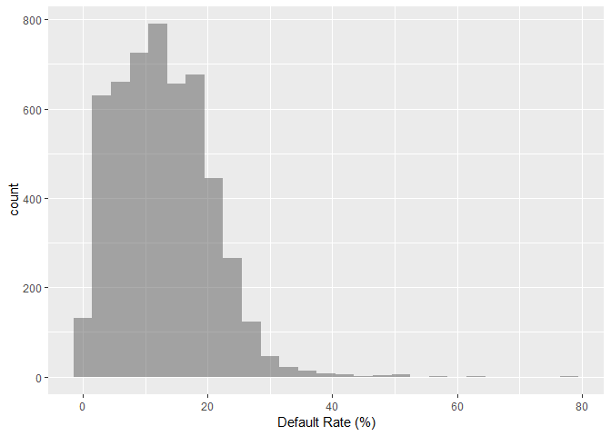<!-- -->

```r
ggplot(sc1415.net,aes(x=CDR3*100, fill=CONTROL)) + 
   geom_histogram(binwidth=3) +
   facet_grid(CONTROL~.) +
   xlab("Default Rate (%)")
```

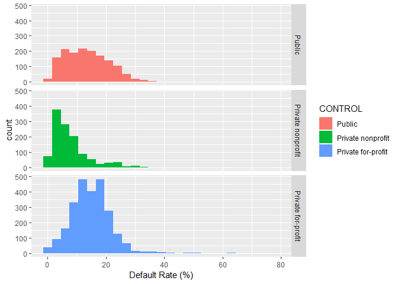<!-- -->

```r
ggplot(sc1415.net,aes(x=CDR3*100, fill=PREDDEG)) + 
   geom_histogram(binwidth=3) +
   facet_grid(PREDDEG~.) +
   xlab("Default Rate (%)")
```

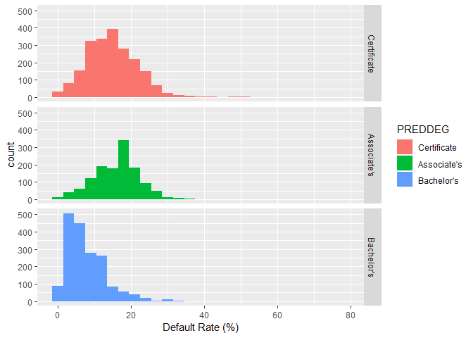<!-- -->

The longer right tails observed in the plots are accounted for by 80 schools which reported 30% or above default rates. It is 1.5% of the sample size. Institutions with 30% or higher default rates for three years in a row or 40%+ for a single year lose federal loan eligibility.

***

#### Average Family Income of Dependent Students vs Default Rate


```r
ggplot(sc1415.net,aes(x=DEP_INC_AVG,y=CDR3*100)) +
   geom_point(alpha=.1, col='blue') +
   geom_smooth(method="lm", col="black") +
   xlab("Family Income of Dependent Students ($)") +
   ylab("Default Rate (%)")
```

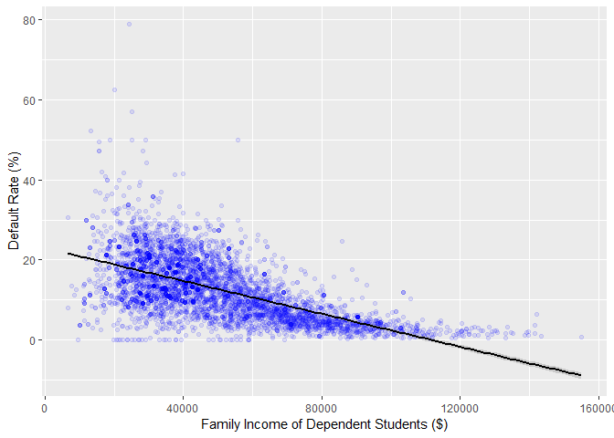<!-- -->

***

#### Average Family Income of Independent Students vs Default Rate


```r
ggplot(sc1415.net,aes(x=IND_INC_AVG,y=CDR3*100)) +
   geom_point(alpha=.1, col='blue') +
   geom_smooth(method="lm", col="black") +
   xlab("Family Income of Independent Students ($)") +
   ylab("Default Rate (%)")
```

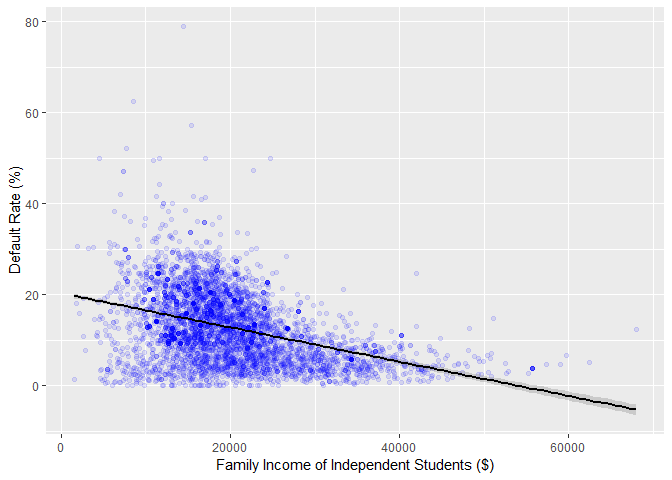<!-- -->

***

#### Loan Amount (Median) vs Default Rate


```r
ggplot(sc1415.net,aes(x=DEBT_MDN,y=CDR3*100)) +
   geom_point(alpha=.1, col='blue') +
   geom_smooth(method="lm", col="black") +
   xlab("Loan Amount - Median ($)") +
   ylab("Default Rate (%)")
```

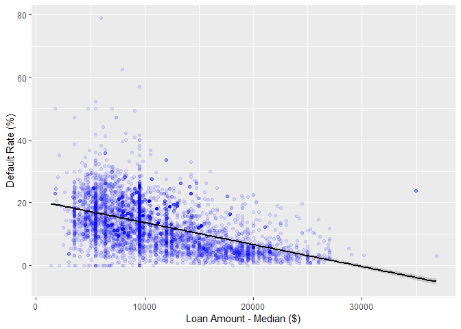<!-- -->

*** 

#### Family Income (Median) vs Default Rate


```r
ggplot(sc1415.net,aes(x=MD_FAMINC,y=CDR3*100)) +
   geom_point(alpha=.1, col='blue') +
   geom_smooth(method="lm", col="black") +
   xlab("Family Income - Median ($)") +
   ylab("Default Rate (%)")
```

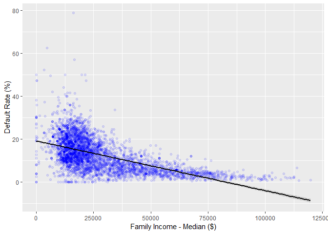<!-- -->

*** 

#### Percentage of First Generation Students vs Default Rate by School Ownership Type


```r
# Percentage first-generation students vs default rate by school ownership type

ggplot(sc1415.net,aes(y=CDR3*100,x=PAR_ED_PCT_1STGEN*100, col=CONTROL)) +
   geom_point(alpha=.1) +
   facet_grid(CONTROL~.) +
   geom_smooth(col="black", method="lm") +
   xlab("Percentage First-Generation Students (%)") +
   ylab("Default Rate (%)")
```

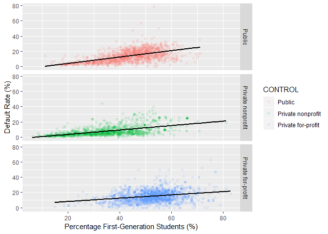<!-- -->

There is a positive correlation between default rate and the proportion of students who reported as first generation in getting higher education. For-profit private schools seem to have a higher mean of the proportions. 

*** 

#### Percentage of First Generation Students vs Default Rate by Predominant Degree Type


```r
ggplot(sc1415.net,aes(y=CDR3*100,x=PAR_ED_PCT_1STGEN*100, col=PREDDEG)) +
   geom_point(alpha=.1) +
   facet_grid(PREDDEG~.) +
   geom_smooth(col="black", method="lm") + 
   xlab("Percentage of Students Receiving Federal Loan (%)") +
   ylab("Default Rate (%)")
```

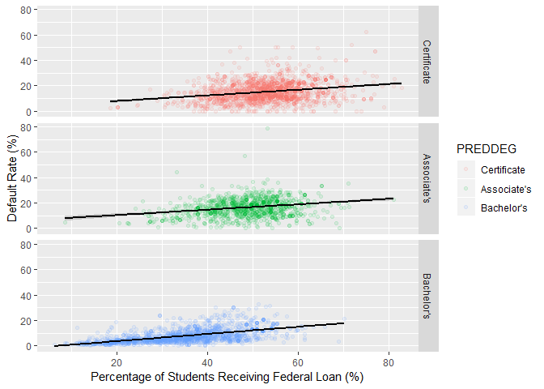<!-- -->

As expected, Associate's and Certificate institutions report higher proportions of first generation students. Regardless of degree types, the parents education level correlates to default rate.

***

#### Percentage of Pell Grant Recipients vs Default Rate by Institution Type based on Predominant Degrees


```r
# Percent of all undergraduate students receiving Pell Grant

ggplot(sc1415.net,aes(y=CDR3*100,x=PCTPELL*100, col=PREDDEG)) +
   geom_point(alpha=.1) +
   facet_grid(PREDDEG~.) + 
   geom_smooth(col="black", method="lm") +
   xlab("Percentage of Students Receiving Pell Grant (%)") +
   ylab("Default Rate (%)")
```

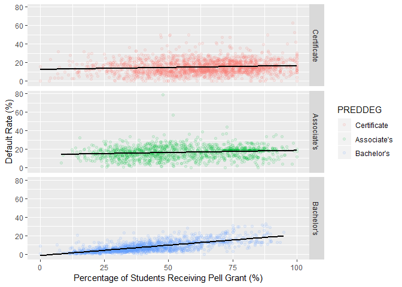<!-- -->

A positive correlation between Pell Grant recipient percentage and default rate is more prominent at Bachelor's degree institutions.  

***

#### Instructional Expenditure Per Student vs Default Rate


```r
# Instructional Expenditure per FTE student

ggplot(sc1415.net,aes(y=CDR3*100,x=INEXPFTE, col=PREDDEG)) +
   geom_point(alpha=.1) +
   facet_grid(PREDDEG~.) + 
   geom_smooth(col="black", method="lm") +
   xlab("Instructional Expenditure Per Student") +
   ylab("Default Rate (%)")
```

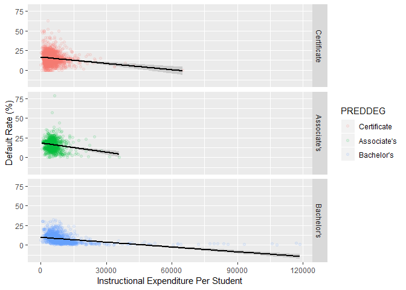<!-- -->


There is a negative correlation between instructional spending and default rate regardless of predominant degree types.  

***

## Categorical Variable Conversion to Dummy Variables

Before building models, categorical variables (`CONTROL`, `PREDDEG`, and `REGION`) need to be converted to dummy variables. `DISTANCEONLY` has been dropped as its values are highly skewed -- only 0.6% is classified as Online-Education Only.


```r
library(caret)

dummies <- dummyVars("~ CONTROL + PREDDEG + REGION", data=sc1415.net,fullRank=TRUE)
dummies <- data.frame(predict(dummies,newdata=sc1415.net))
sc1415.final <- as.data.frame(cbind(sc1415.net,dummies))

# remove variables unused in model building

sc1415.final$OPEID6 <-  NULL
sc1415.final$STABBR <-  NULL
sc1415.final$INSTNM <-  NULL

sc1415.final$CONTROL <- NULL
sc1415.final$REGION  <- NULL
sc1415.final$PREDDEG <- NULL
sc1415.final$DISTANCEONLY <- NULL
```

***

## Predictive Model Building

Now, the `sc1415.final` data frame is all set for building models.  It consists of 5209 observations and 27 independent variables.  The `CDR3` is the outcome variable.  The goal is to predict student loan default rates.

Let's split the data frame to training and test sets.  They are `Train` and `Test` data frames.


```r
library(caTools)
set.seed(100)
split_vec <- sample.split(sc1415.final$CDR3,SplitRatio=.75)
Train <- sc1415.final[split_vec,]
Test <- sc1415.final[!(split_vec),]
```


### Model 1 - Linear Regression


Using 10-fold cross-validation, we select the smallest set of variables that minimizes the Root Mean Square Error (RMSE) in stepwise backward variable selection.


```r
set.seed(100)
k = 10
train.control <- trainControl(method = "cv", number = k)

nvmaxCV <- train(CDR3 ~., data = Train,
                    method = "leapBackward", 
                    tuneGrid = data.frame(nvmax = 1:(ncol(Train)-1)),
                    trControl = train.control
                    )
nvmaxCV$results
```

```
##    nvmax       RMSE  Rsquared        MAE      RMSESD RsquaredSD
## 1      1 0.06042187 0.3746326 0.04489242 0.003493258 0.03506420
## 2      2 0.05907442 0.4024027 0.04311222 0.003544106 0.03359510
## 3      3 0.05860681 0.4117629 0.04216707 0.003831313 0.03983273
## 4      4 0.05815742 0.4207063 0.04169573 0.004040082 0.04458760
## 5      5 0.05761608 0.4314074 0.04141743 0.003947688 0.04585973
## 6      6 0.05684507 0.4462972 0.04088071 0.003870243 0.04558429
## 7      7 0.05663073 0.4505901 0.04068660 0.003929475 0.04520136
## 8      8 0.05676763 0.4479699 0.04073018 0.003914584 0.04514612
## 9      9 0.05678739 0.4477244 0.04076832 0.003885999 0.04427428
## 10    10 0.05653473 0.4526791 0.04063332 0.003966093 0.04567648
## 11    11 0.05641419 0.4549535 0.04055309 0.003937484 0.04488482
## 12    12 0.05603429 0.4622491 0.04026936 0.003885051 0.04327044
## 13    13 0.05601060 0.4626423 0.04024885 0.003849686 0.04363121
## 14    14 0.05583208 0.4660684 0.04011359 0.003890354 0.04378341
## 15    15 0.05582529 0.4661848 0.04006381 0.003887306 0.04385671
## 16    16 0.05581793 0.4662772 0.04007770 0.003896934 0.04367486
## 17    17 0.05583808 0.4659163 0.04008748 0.003934032 0.04408551
## 18    18 0.05582777 0.4660849 0.04006134 0.003947600 0.04430707
## 19    19 0.05579594 0.4667390 0.04004314 0.003907067 0.04342891
## 20    20 0.05580249 0.4666520 0.04004016 0.003870643 0.04265928
## 21    21 0.05579982 0.4667062 0.04002324 0.003861007 0.04249832
## 22    22 0.05581605 0.4664073 0.04004026 0.003855531 0.04246404
## 23    23 0.05579413 0.4668569 0.04002962 0.003862390 0.04259842
## 24    24 0.05577398 0.4672306 0.04000290 0.003872024 0.04279594
## 25    25 0.05577778 0.4671530 0.04000784 0.003872907 0.04282196
## 26    26 0.05578306 0.4670512 0.04001158 0.003871275 0.04281087
## 27    27 0.05578234 0.4670664 0.04001131 0.003869547 0.04278190
##          MAESD
## 1  0.001560019
## 2  0.001559422
## 3  0.001694091
## 4  0.001867042
## 5  0.001890929
## 6  0.001749668
## 7  0.001816850
## 8  0.001824488
## 9  0.001848145
## 10 0.001923344
## 11 0.001907806
## 12 0.001850159
## 13 0.001871314
## 14 0.001886986
## 15 0.001882195
## 16 0.001871454
## 17 0.001869106
## 18 0.001882309
## 19 0.001880437
## 20 0.001862816
## 21 0.001860877
## 22 0.001856932
## 23 0.001847855
## 24 0.001867421
## 25 0.001871314
## 26 0.001873227
## 27 0.001873109
```

While the # of predictors recommended is 24, a dip is observed at 19. The RMSE delta between 19 and 24 nvmax levels is negligible. In the spirit of keeping the model as simply as possible, we will use 19 variables. 

The top 19 predictors are as follows:


```r
names(coef(nvmaxCV$finalModel,19))
```

```
##  [1] "(Intercept)"                "UGDS"                      
##  [3] "INEXPFTE"                   "PCTPELL"                   
##  [5] "PAR_ED_PCT_1STGEN"          "DEP_INC_AVG"               
##  [7] "IND_INC_AVG"                "DEBT_MDN"                  
##  [9] "GRAD_DEBT_MDN"              "WDRAW_DEBT_MDN"            
## [11] "CONTROL.Private.nonprofit"  "CONTROL.Private.for.profit"
## [13] "PREDDEG.Associate.s"        "PREDDEG.Bachelor.s"        
## [15] "REGION.Mid.East"            "REGION.Plains"             
## [17] "REGION.Southeast"           "REGION.Southwest"          
## [19] "REGION.Rocky.Mtn"           "REGION.Outlying.Areas"
```

Let's build a linear regression model with these variables.


```r
lm1 <- lm(CDR3 ~ UGDS+INEXPFTE+PCTPELL+PAR_ED_PCT_1STGEN+
          DEP_INC_AVG+IND_INC_AVG+
          DEBT_MDN+GRAD_DEBT_MDN+WDRAW_DEBT_MDN+
          CONTROL.Private.nonprofit+CONTROL.Private.for.profit+
          PREDDEG.Associate.s+PREDDEG.Bachelor.s+
          REGION.Mid.East+REGION.Plains+REGION.Southeast+REGION.Southwest+REGION.Rocky.Mtn+REGION.Outlying.Areas,

          data=Train)

summary(lm1)
```

```
## 
## Call:
## lm(formula = CDR3 ~ UGDS + INEXPFTE + PCTPELL + PAR_ED_PCT_1STGEN + 
##     DEP_INC_AVG + IND_INC_AVG + DEBT_MDN + GRAD_DEBT_MDN + WDRAW_DEBT_MDN + 
##     CONTROL.Private.nonprofit + CONTROL.Private.for.profit + 
##     PREDDEG.Associate.s + PREDDEG.Bachelor.s + REGION.Mid.East + 
##     REGION.Plains + REGION.Southeast + REGION.Southwest + REGION.Rocky.Mtn + 
##     REGION.Outlying.Areas, data = Train)
## 
## Residuals:
##      Min       1Q   Median       3Q      Max 
## -0.20448 -0.03155 -0.00322  0.02637  0.58661 
## 
## Coefficients:
##                              Estimate Std. Error t value Pr(>|t|)    
## (Intercept)                 1.815e-01  1.149e-02  15.802  < 2e-16 ***
## UGDS                       -9.494e-07  1.911e-07  -4.968 7.05e-07 ***
## INEXPFTE                   -7.579e-07  1.543e-07  -4.911 9.42e-07 ***
## PCTPELL                     1.354e-02  6.655e-03   2.034 0.042003 *  
## PAR_ED_PCT_1STGEN           7.783e-02  1.578e-02   4.932 8.47e-07 ***
## DEP_INC_AVG                -7.796e-07  9.822e-08  -7.937 2.69e-15 ***
## IND_INC_AVG                -1.803e-06  1.467e-07 -12.295  < 2e-16 ***
## DEBT_MDN                   -2.805e-06  4.085e-07  -6.867 7.57e-12 ***
## GRAD_DEBT_MDN               2.129e-06  2.372e-07   8.975  < 2e-16 ***
## WDRAW_DEBT_MDN              1.322e-06  6.203e-07   2.130 0.033206 *  
## CONTROL.Private.nonprofit  -1.605e-02  3.223e-03  -4.979 6.65e-07 ***
## CONTROL.Private.for.profit -3.098e-02  3.147e-03  -9.844  < 2e-16 ***
## PREDDEG.Associate.s         6.334e-03  2.990e-03   2.119 0.034195 *  
## PREDDEG.Bachelor.s         -4.081e-02  4.387e-03  -9.301  < 2e-16 ***
## REGION.Mid.East            -8.084e-03  2.735e-03  -2.955 0.003142 ** 
## REGION.Plains               1.127e-02  3.399e-03   3.317 0.000918 ***
## REGION.Southeast            1.068e-02  2.440e-03   4.378 1.23e-05 ***
## REGION.Southwest            2.115e-02  3.175e-03   6.661 3.09e-11 ***
## REGION.Rocky.Mtn            1.646e-02  4.814e-03   3.420 0.000632 ***
## REGION.Outlying.Areas      -1.634e-02  9.619e-03  -1.698 0.089532 .  
## ---
## Signif. codes:  0 '***' 0.001 '**' 0.01 '*' 0.05 '.' 0.1 ' ' 1
## 
## Residual standard error: 0.05568 on 3903 degrees of freedom
## Multiple R-squared:  0.4714,	Adjusted R-squared:  0.4688 
## F-statistic: 183.2 on 19 and 3903 DF,  p-value: < 2.2e-16
```

The RMSE is 0.0555341.


```r
sqrt(sum(lm1$residuals^2)/nrow(Train))
```

```
## [1] 0.0555341
```

The following plot shows that the residuals bounce around the y=0 horizontal line, confirming the validity of the model.


```r
ggplot(data=Train,aes(x=as.numeric(row.names(Train)),y=lm1$residuals)) + geom_point(alpha=.2) +
   xlab("Training Set Row Index") +
   ylab("Residual")
```

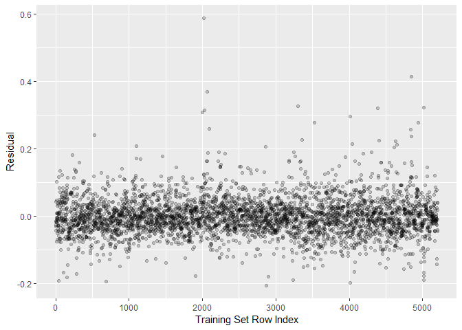<!-- -->

Now, run the model on the `Test` set.


```r
# Prediction
lm1.pred <- predict(lm1, newdata=Test)
residualTest <- (lm1.pred - Test$CDR3)
# RMSE
sqrt(sum(residualTest^2)/nrow(Test))
```

```
## [1] 0.05000767
```
The RMSE at 0.05 is a bit lower than that of the training set (0.0555341).


### Model 2 - Classification and Regression Tree (CART)

In this modeling, we will create a decision tree whose end nodes of branches show average default rates. Let's build a model using all predictors, plot the resulting tree and compute the RMSE.


```r
library(rpart)
library(rpart.plot)

defaultsTree = rpart(CDR3 ~ .,
                     data=Train
                    
)

prp(defaultsTree)  # plotting the tree
```

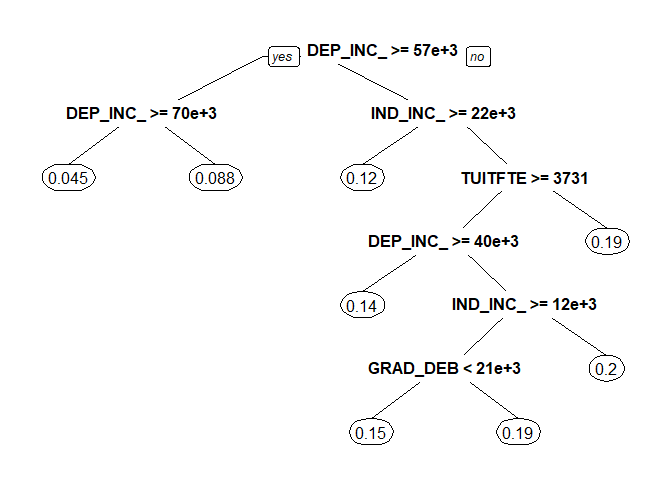<!-- -->

```r
predictCART = predict(defaultsTree,newdata=Test)    

residualTestCART <- (predictCART- Test$CDR3)

# RMSE
sqrt(sum(residualTestCART^2)/nrow(Test))
```

```
## [1] 0.05141852
```

Interestingly, the tree references only 4 variables -- `DEP_INC_AVG`, `IND_INC_AVG`, `TUITFTE`, and `GRAD_DEB`.  The descriptions of these columns are as follows:

    `DEP_INC_AVG`: Average family income of dependent students in real 2015 dollars    
    `IND_INC_AVG`: Average family income of independent students in real 2015 dollars   
    `TUITFTE`: Net tuition revenue per full-time equivalent student  
    `GRAD_DEB_MDN`: The median debt for students who have completed  

The RMSE is 0.0514 which is higher than the linear regression model's (0.05).


### Model 3 - Random Forest (RF)

Moving on to the 3rd model, Random Forest lacks interpretability, but results in a better accuracy.  


```r
library("randomForest")

defaultsForest = randomForest(CDR3 ~
          UGDS+INEXPFTE+PCTPELL+PAR_ED_PCT_1STGEN+
          DEP_INC_AVG+IND_INC_AVG+
          DEBT_MDN+GRAD_DEBT_MDN+WDRAW_DEBT_MDN+
          CONTROL.Private.nonprofit+CONTROL.Private.for.profit+
          PREDDEG.Associate.s+PREDDEG.Bachelor.s+
          REGION.Mid.East+REGION.Plains+REGION.Southeast+REGION.Southwest+REGION.Rocky.Mtn+REGION.Outlying.Areas,

          data=Train,
          nodesize=25,
          ntree=200)
predictForest = predict(defaultsForest,newdata=Test) 
residualTestForest <- (predictForest- Test$CDR3)

#RMSE
sqrt(sum(residualTestForest^2)/nrow(Test))
```

```
## [1] 0.04495323
```

```r
varImpPlot(defaultsForest)
```

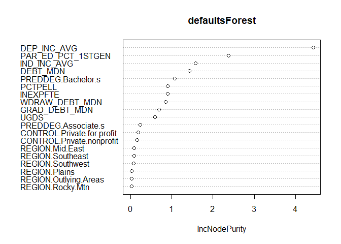<!-- -->

Its RMSE is indeed the lowest of the 3 models at 0.045.  The model identified the following seven as the top predictors:

`DEP_INC_AVG`: Average family income of dependent students in real 2015 dollars   
`PAR_ED_PCT_1STGEN`: Percentage first-generation students  
`IND_INC_AVG`: Average family income of independent students in real 2015 dollars    
`DEBT_MDN`: The median original amount of the loan principal upon entering repayment  
`PREDDEG.Bachelor.s`: Bachelor's being the predominant degree   
`PCTPELL`: Percentage of undergraduates who receive a Pell Grant
`INEXPFTE`: Instructional expenditures per full-time equivalent (FTE) student  
`WDRAW_DEBT_MDN`: The median debt for students who have not completed  

*** 

# Inferences and Insights

* As noted in the Random Forest model, the top predictors for default rate are familly income, parent education level, loan principle amount, institution's predominant degree (Bachelor's), percentage of Pell Grant recipients, instructional spending, debt amount for withdrawn students.    
* A $10,000 increase in average family income of dependent students (`DEP_INC_AVG`) is associated with a decrease in default rate by 0.8% provided all other variables being fixed.  
* A $10,000 increase in average family income of independent students (`IND_INC_AVG`) is associated with a decrease in default rate by 1.8% provided all other variables being fixed.  
* One point increase in the percentage of first generation students (`PAR_ED_PCT_1STGEN` - those whose parents' education level is below post-secondary) is associated with an increase in default rate by 7.8% provided all other variables being fixed.  
* A $10,000 **increase** in median loan amount (`DEBT_MDN`) is associated with a **decrease** in default rate by 2.8% provided all other variables being fixed.  
* One percent increase in the Federal Pell Grant participation rate (`PCTPELL`) is associated with an increase in default rate by 1.35% provided all other variables being fixed.  
* Associate's as predominant degree (`PREDDEG.Associate.s`) is associated with an increase in default rate (relative to Certificate as predominant degree) .  On the other hand, Bachelor's degree as predominant degree (`PREDDEG.Bachelor.s`) is associated with a decrease in default rate (relative to Certificate as predominant degree).  
* $10,000 expensed in instructional resources per FTE student (`INEXPFTE`) is associated with a decrease in default rate by 0.8% provided all other variables being fixed.   
* Relative to the New England region, the Plains, Southeast, Southwest and Rocky Mountain regions are associated with an increase in default rate whereas the Mid East and Outlying Areas regions with a decrease.   
* The CART model tree illustrates 12% or higher average default rate for the institutions whose the family income level for independent students is below $22,000 and for dependent students below $57,000. [The annual median income for high school diploma holders is about $25,000](http://www.aplu.org/projects-and-initiatives/college-costs-tuition-and-financial-aid/publicuvalues/student-debt.html). This group of institutions accounts for almost 60% of the sample -- 3008 out of 5209.   


***

# References

https://www.yahoo.com/amphtml/finance/news/millennial-marriages-crumbling-student-loan-debt-134145853.html  

https://college-education.procon.org/  

https://www.politifact.com/truth-o-meter/statements/2015/aug/14/jeb-bush/jeb-bush-student-loan-debt-has-doubled-under-obama/  

https://collegescorecard.ed.gov/assets/CollegeScorecardDataDictionary.xlsx  

http://www.ncsl.org/research/labor-and-employment/state-minimum-wage-chart.aspx   

https://collegescorecard.ed.gov/assets/FullDataDocumentation.pdf  

http://www.sthda.com/english/articles/37-model-selection-essentials-in-r/154-stepwise-regression-essentials-in-r/  

http://www.aplu.org/projects-and-initiatives/college-costs-tuition-and-financial-aid/publicuvalues/student-debt.html  
