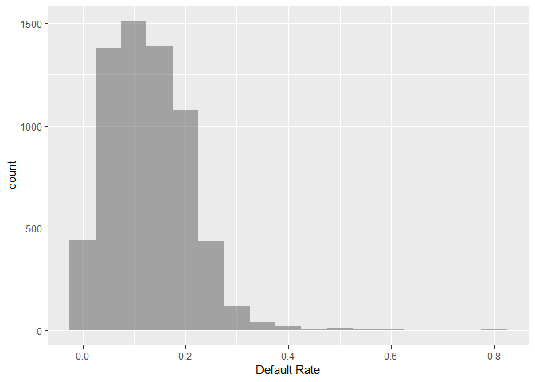
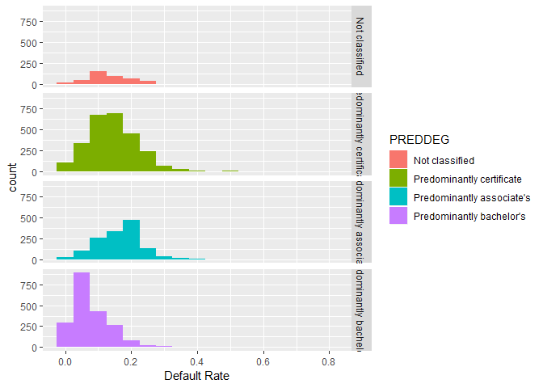
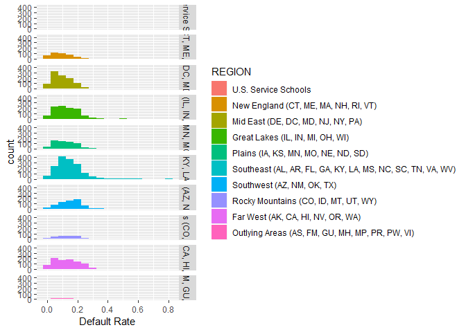

# Introduction

Student loan debt (SLD) total in the US reached a staggering number in 1.5 trillion dollars, borrowed by 44 million people. It is 2.4 times larger than the total of credit card debt.  The SLD total in 2008 was 640 billion dollars [which ballooned to 1.2 trillion by 2015](https://www.politifact.com/truth-o-meter/statements/2015/aug/14/jeb-bush/jeb-bush-student-loan-debt-has-doubled-under-obama/).  

The US Department of Education publishes the College Scorecard data to help the public to make informed decisions about investments in higher education.  The data features large amount of metrics and is organized by academic year. In this report, we will focus on the 2014-15 scorecard data.  The goals of this report are:

- Explore the data to ascertain some trends the data is telling us.
- Find out strong predictors affecting default rates.
- Build a prediction model for default rates.


# Data Load

This data set is a part of a [data bundle](https://ed-public-download.app.cloud.gov/downloads/CollegeScorecard_Raw_Data.zip) published by the US Department of Education.  This analysis utilizes the data pertinent to the 2014-15 academic year cohort (`MERGED2014_15_PP.csv`). The full data documentation is found [here](https://collegescorecard.ed.gov/assets/FullDataDocumentation.pdf).


```r
# Load the college scorecard data set for academic year 14-15

scorecard1415<- read.csv("MERGED2014_15_PP.csv",na.strings=c("NULL","PrivacySuppressed"))
scorecard1415 <- tbl_df(scorecard1415)
```

***
# Data Wrangling

## Strategy

- Clean up the data set.
    - Select variables relevant to this study.
    - Standardize column names if necessary.
    - Inspect presence of missing value.
    - Determin missing value treatment strategy if applicable.
    - Transform data types appropriately.


## Select relevant variables 

As there are a large number (1700+) of variables in `scorecard` data set, the [data element list](https://collegescorecard.ed.gov/assets/CollegeScorecardDataDictionary.xlsx) has been reviewed. Using the [data documentation](https://collegescorecard.ed.gov/assets/FullDataDocumentation.pdf) as guidelines, the variables are selected in the following code block:


```r
sc1415.all <- scorecard1415 %>% select(OPEID6,INSTNM,STABBR,NUMBRANCH,CONTROL,PREDDEG,
                               REGION,
                               LOCALE,LATITUDE,LONGITUDE,CCBASIC,
                               CCUGPROF,CCSIZSET,RELAFFIL,
                               ADM_RATE_ALL,
                               DISTANCEONLY,UGDS,UG,
                               UGDS_WHITE,UGDS_BLACK,UGDS_HISP,UGDS_ASIAN,
                               CURROPER,
                               NPT4_PUB,NPT4_PRIV,
                               NUM4_PUB,NUM4_PRIV,
                               TUITFTE,INEXPFTE,AVGFACSAL,
                               PFTFAC,
                               PCTPELL,
                               C150_4,
                               RET_FT4,
                               PCTFLOAN,
                               UG25ABV,
                               CDR2,
                               CDR3,
                               PAR_ED_PCT_1STGEN,
                               DEP_INC_AVG,
                               IND_INC_AVG,
                               DEBT_MDN,
                               GRAD_DEBT_MDN,
                               WDRAW_DEBT_MDN,
                               FAMINC,
                               MD_FAMINC,
                               POVERTY_RATE,
                               MN_EARN_WNE_P10,
                               MD_EARN_WNE_P10,
                               CDR3_DENOM
)
```


The `CDR3` column reports the default rate. Hence, the observations with missing values in the column cannot be used for this analysis.  They are removed. 


```r
sc1415 <- sc1415.all %>% filter(!is.na(CDR3))
```

It's observed that missing values are rather concentrated on the schools classified as stand alone graduate institutions. Let's remove them from the analysis.


```r
sc1415 <- sc1415 %>% filter(PREDDEG!=4)
```


## Missing Values

Are there any columns with missiong values?


```r
names(sc1415)[colSums(is.na(sc1415))>0]
```

```
##  [1] "LOCALE"            "LATITUDE"          "LONGITUDE"        
##  [4] "CCBASIC"           "CCUGPROF"          "CCSIZSET"         
##  [7] "RELAFFIL"          "ADM_RATE_ALL"      "DISTANCEONLY"     
## [10] "UGDS"              "UG"                "UGDS_WHITE"       
## [13] "UGDS_BLACK"        "UGDS_HISP"         "UGDS_ASIAN"       
## [16] "CURROPER"          "NPT4_PUB"          "NPT4_PRIV"        
## [19] "NUM4_PUB"          "NUM4_PRIV"         "TUITFTE"          
## [22] "INEXPFTE"          "AVGFACSAL"         "PFTFAC"           
## [25] "PCTPELL"           "C150_4"            "RET_FT4"          
## [28] "PCTFLOAN"          "UG25ABV"           "CDR2"             
## [31] "PAR_ED_PCT_1STGEN" "DEP_INC_AVG"       "IND_INC_AVG"      
## [34] "DEBT_MDN"          "GRAD_DEBT_MDN"     "WDRAW_DEBT_MDN"   
## [37] "FAMINC"            "MD_FAMINC"         "POVERTY_RATE"     
## [40] "MN_EARN_WNE_P10"   "MD_EARN_WNE_P10"
```

44 of 50 columns have missing values.  Let's compute their proportions and select those under 10%.


```r
naProportion <- apply(sc1415,2,function(x){sum(is.na(x))/nrow(sc1415)})
naProportion[naProportion<.1]
```

```
##            OPEID6            INSTNM            STABBR         NUMBRANCH 
##       0.000000000       0.000000000       0.000000000       0.000000000 
##           CONTROL           PREDDEG            REGION      DISTANCEONLY 
##       0.000000000       0.000000000       0.000000000       0.063054647 
##              UGDS        UGDS_WHITE        UGDS_BLACK         UGDS_HISP 
##       0.063988790       0.063988790       0.063988790       0.063988790 
##        UGDS_ASIAN           TUITFTE          INEXPFTE           PCTPELL 
##       0.063988790       0.064611552       0.064611552       0.065390005 
##          PCTFLOAN              CDR3 PAR_ED_PCT_1STGEN       DEP_INC_AVG 
##       0.065390005       0.000000000       0.076911101       0.035964503 
##       IND_INC_AVG          DEBT_MDN     GRAD_DEBT_MDN    WDRAW_DEBT_MDN 
##       0.035964503       0.015569049       0.062120504       0.084072863 
##            FAMINC         MD_FAMINC        CDR3_DENOM 
##       0.003580881       0.003580881       0.000000000
```

```r
# naProportion_all <- apply(scorecard1415,2,function(x){sum(is.na(x))/nrow(scorecard1415)})
# naProportion_all[naProportion_all<.1]
```


This group predominently consists of graduate schools or the ones without  predominent degree reported. 

Let's confirm that all `CDR3` and `CDR3_DENOM` values are numeric.


```r
sum(!is.numeric(sc1415$CDR3))
```

```
## [1] 0
```

```r
sum(!is.numeric(sc1415$CDR3_DENOM))
```

```
## [1] 0
```

## Variable selection

Now select the variables with less than 10% missing value. Further clean up by eliminating the rows with missing values (Caveat: This is a simpliest approach of treating missing values.  This may have to be revisited in pursuit of a more efficient strategy.)

(Qu: a better way to select the variables of interest without hard coding, but utilizing the output from the `naProportion` code chunk?)


```r
sc1415 <- sc1415 %>% select(OPEID6, INSTNM, STABBR, NUMBRANCH, CONTROL, PREDDEG, REGION,
                             DISTANCEONLY, TUITFTE, INEXPFTE, 
                             PCTPELL, PCTFLOAN, CDR3, PAR_ED_PCT_1STGEN,
                             DEP_INC_AVG, IND_INC_AVG, 
                             DEBT_MDN, GRAD_DEBT_MDN, WDRAW_DEBT_MDN,
                             FAMINC, MD_FAMINC, CDR3_DENOM)

sc1415.net <- sc1415[complete.cases(sc1415),]


names(sc1415)[colSums(is.na(sc1415.net))>0]
```

```
## character(0)
```

The total number of rows has reduced from 6423 to 5210. 
The summary statistics of default rates (`CDR3`) are comparable amongst the three data sets -- with graduate schools present, without grad schools, and without missing values.  We will move ahead with the the `sc1415.net` data frame for the analysis.

(Qu: would you recommend a box plot to confirm this point?)


```r
summary(sc1415.all$CDR3)
```

```
##    Min. 1st Qu.  Median    Mean 3rd Qu.    Max.    NA's 
##  0.0000  0.0600  0.1160  0.1235  0.1770  0.7890    1016
```

```r
summary(sc1415$CDR3)
```

```
##    Min. 1st Qu.  Median    Mean 3rd Qu.    Max. 
##  0.0000  0.0650  0.1200  0.1272  0.1800  0.7890
```

```r
summary(sc1415.net$CDR3)
```

```
##    Min. 1st Qu.  Median    Mean 3rd Qu.    Max. 
##   0.000   0.069   0.125   0.129   0.182   0.789
```


## Converting to factor variables

Convert `CONTROL`, `PREDDEG`, `DISTANCEONLY`, and `REGION` to factor variables.


```r
control_list = c(1:3)
control_descs = c("Public",
                  "Private nonprofit",
                  "Private for-profit")

sc1415 <- sc1415 %>% mutate(CONTROL = factor(CONTROL,levels=control_list,
                                             labels=control_descs))
# 1	Public
# 2	Private nonprofit
# 3	Private for-profit


preddeg_list = c(0:4)
preddeg_descs = c("Not classified",
                  "Predominantly certificate",
                  "Predominantly associate's",
                  "Predominantly bachelor's",
                  "Entirely graduate-degree")

sc1415 <- sc1415 %>% mutate(PREDDEG = factor(PREDDEG,levels=preddeg_list,
                                             labels=preddeg_descs))

# 0	Not classified	IPEDS
# 1	Predominantly certificate-degree granting	
# 2	Predominantly associate's-degree granting	
# 3	Predominantly bachelor's-degree granting	
# 4	Entirely graduate-degree granting	


distanceonly_list = c(0:1)
distanceonly_descs = c("Not OnlineEd Only",
                  "OnlineEd Only")

sc1415 <- sc1415 %>% mutate(CONTROL = factor(DISTANCEONLY,levels=distanceonly_list,
                                             labels=distanceonly_descs))

#0	Not distance-education only
#1	Distance-education only


region_list = c(0:9)
region_descs = c("U.S. Service Schools",
                 "New England (CT, ME, MA, NH, RI, VT)",
                 "Mid East (DE, DC, MD, NJ, NY, PA)",
                 "Great Lakes (IL, IN, MI, OH, WI)",
                 "Plains (IA, KS, MN, MO, NE, ND, SD)",
                 "Southeast (AL, AR, FL, GA, KY, LA, MS, NC, SC, TN, VA, WV)",
                 "Southwest (AZ, NM, OK, TX)",
                 "Rocky Mountains (CO, ID, MT, UT, WY)",
                 "Far West (AK, CA, HI, NV, OR, WA)",
                 "Outlying Areas (AS, FM, GU, MH, MP, PR, PW, VI)")

sc1415 <- sc1415 %>% mutate(REGION = factor(REGION,levels=region_list,
                                             labels=region_descs))


# 0	U.S. Service Schools	
# 1	New England (CT, ME, MA, NH, RI, VT)		
# 2	Mid East (DE, DC, MD, NJ, NY, PA)		
# 3	Great Lakes (IL, IN, MI, OH, WI)		
# 4	Plains (IA, KS, MN, MO, NE, ND, SD)		
# 5	Southeast (AL, AR, FL, GA, KY, LA, MS, NC, SC, TN, VA, WV)		
# 6	Southwest (AZ, NM, OK, TX)		
# 7	Rocky Mountains (CO, ID, MT, UT, WY)		
# 8	Far West (AK, CA, HI, NV, OR, WA)		
# 9	Outlying Areas (AS, FM, GU, MH, MP, PR, PW, VI)		
```

# Exploratory Data Analysis (WIP)

>>>>>>>>>>>>>> more plots to be added <<<<<<<<<<<<<<<<<<<<<<<<<<<<<<<

## Quick Descriptive Statistics

The total number of students who entered repayment between October 2013 and September 2014 is 34577702. 

Let's draw some histograms.


```r
ggplot(sc1415,aes(x=CDR3)) + 
   geom_histogram(binwidth=.05,alpha=.5) +
   xlab("Default Rate")
```

<!-- -->

```r
ggplot(sc1415,aes(x=CDR3, fill=PREDDEG)) + 
   geom_histogram(binwidth=.05) +
   facet_grid(PREDDEG~.) +
   xlab("Default Rate")
```

<!-- -->

```r
ggplot(sc1415,aes(x=CDR3, fill=REGION)) + 
   geom_histogram(binwidth=.05) +
   facet_grid(REGION~.) +
   xlab("Default Rate")
```

<!-- -->


