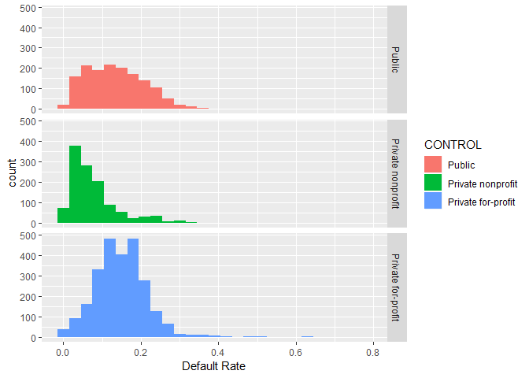
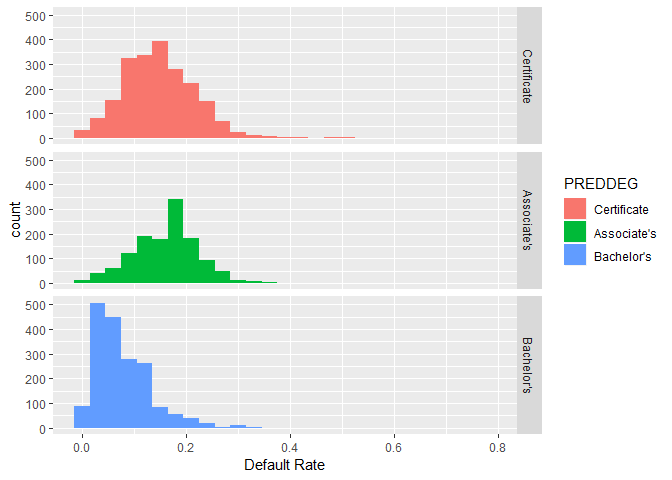
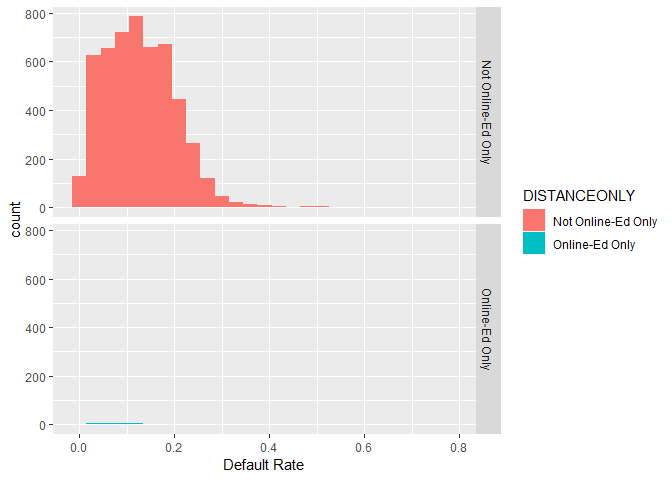
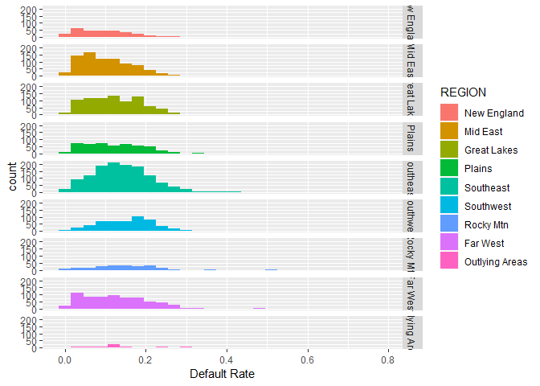
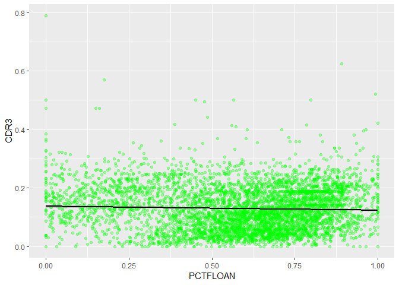

# Introduction

Student loan debt (SLD) total in the US reached a staggering number in 1.5 trillion dollars, borrowed by 44 million people. It is 2.4 times larger than the total of credit card debt.  The SLD total in 2008 was 640 billion dollars [which ballooned to 1.2 trillion by 2015](https://www.politifact.com/truth-o-meter/statements/2015/aug/14/jeb-bush/jeb-bush-student-loan-debt-has-doubled-under-obama/).  

While [the return on investment of higher education (HED) is well known and documented] (https://college-education.procon.org/), student loans accumulated for financing higher education are reported as societal issues such as [reasons for divorce](https://www.yahoo.com/amphtml/finance/news/millennial-marriages-crumbling-student-loan-debt-134145853.html), financial dependence on parents, and lack of home ownership observed in Gen-Y.  

In order for an student to be able to pay off HED loans, the loan total should not exceed his/her annual income from gainful employment the HED would provide.  For unfortunate some, this rule of thumb was violated and loan defaults resulted. 

The US Department of Education publishes the College Scorecard data to help the public to make informed decisions about investments in higher education.  The data features large amount of metrics including default rates and is organized by academic year. In this report, we will focus on the 2014-15 scorecard data.  The goals of this report are:

- Explore the data to ascertain some trends the data is telling us.
- Find out strong predictors affecting default rates.
- Build a prediction model for default rates.


# Data Load

This data set is a part of a [data bundle](https://ed-public-download.app.cloud.gov/downloads/CollegeScorecard_Raw_Data.zip) published by the US Department of Education.  This analysis utilizes the data pertinent to the 2014-15 academic year cohort (`MERGED2014_15_PP.csv`). The full data documentation is found [here](https://collegescorecard.ed.gov/assets/FullDataDocumentation.pdf).


```r
# Load the college scorecard data set for academic year 14-15

scorecard1415<- read.csv("MERGED2014_15_PP.csv",na.strings=c("NULL","PrivacySuppressed"))
scorecard1415 <- tbl_df(scorecard1415)
```

***
# Data Wrangling

## Strategy 1

- Clean up the data set.
    - Select variables relevant to this study.
    - Standardize column names if necessary.
    - Inspect presence of missing value.
    - Determin missing value treatment strategy if applicable.
    - Transform data types appropriately.


## Select relevant variables 

Two issues with the data set are noticed immediately. 

- First, the number of variables/features is overwhelmingly large at 1700+.
- Secondly, many rows have missing values. 

To address the first issue, the [data element list](https://collegescorecard.ed.gov/assets/CollegeScorecardDataDictionary.xlsx) has been reviewed. Using the [data documentation](https://collegescorecard.ed.gov/assets/FullDataDocumentation.pdf) as guidelines, the variables are selected in the following code block:


```r
sc1415.all <- scorecard1415 %>% select(OPEID6,INSTNM,STABBR,NUMBRANCH,CONTROL,PREDDEG,
                               REGION,
                               LOCALE,LATITUDE,LONGITUDE,CCBASIC,
                               CCUGPROF,CCSIZSET,RELAFFIL,
                               ADM_RATE_ALL,
                               DISTANCEONLY,UGDS,UG,
                               UGDS_WHITE,UGDS_BLACK,UGDS_HISP,UGDS_ASIAN,
                               CURROPER,
                               NPT4_PUB,NPT4_PRIV,
                               NUM4_PUB,NUM4_PRIV,
                               TUITFTE,INEXPFTE,AVGFACSAL,
                               PFTFAC,
                               PCTPELL,
                               C150_4,
                               RET_FT4,
                               PCTFLOAN,
                               UG25ABV,
                               CDR2,
                               CDR3,
                               PAR_ED_PCT_1STGEN,
                               DEP_INC_AVG,
                               IND_INC_AVG,
                               DEBT_MDN,
                               GRAD_DEBT_MDN,
                               WDRAW_DEBT_MDN,
                               FAMINC,
                               MD_FAMINC,
                               POVERTY_RATE,
                               MN_EARN_WNE_P10,
                               MD_EARN_WNE_P10,
                               CDR3_DENOM
)
```


The `CDR3` column reports the default rate. Hence, the observations with missing values in the column cannot be used for this analysis.  They are removed. 


```r
sc1415 <- sc1415.all %>% filter(!is.na(CDR3))
```

As for missing values, tt's observed that they are rather concentrated on the schools classified as stand alone graduate institutions. Let's remove them from the analysis.


```r
sc1415 <- sc1415 %>% filter(PREDDEG!=4)
```

## Missing Values

Even after removing the grad school rows, are there any columns with missiong values?


```r
names(sc1415)[colSums(is.na(sc1415))>0]
```

```
##  [1] "LOCALE"            "LATITUDE"          "LONGITUDE"        
##  [4] "CCBASIC"           "CCUGPROF"          "CCSIZSET"         
##  [7] "RELAFFIL"          "ADM_RATE_ALL"      "DISTANCEONLY"     
## [10] "UGDS"              "UG"                "UGDS_WHITE"       
## [13] "UGDS_BLACK"        "UGDS_HISP"         "UGDS_ASIAN"       
## [16] "CURROPER"          "NPT4_PUB"          "NPT4_PRIV"        
## [19] "NUM4_PUB"          "NUM4_PRIV"         "TUITFTE"          
## [22] "INEXPFTE"          "AVGFACSAL"         "PFTFAC"           
## [25] "PCTPELL"           "C150_4"            "RET_FT4"          
## [28] "PCTFLOAN"          "UG25ABV"           "CDR2"             
## [31] "PAR_ED_PCT_1STGEN" "DEP_INC_AVG"       "IND_INC_AVG"      
## [34] "DEBT_MDN"          "GRAD_DEBT_MDN"     "WDRAW_DEBT_MDN"   
## [37] "FAMINC"            "MD_FAMINC"         "POVERTY_RATE"     
## [40] "MN_EARN_WNE_P10"   "MD_EARN_WNE_P10"
```

44 of 50 columns still have missing values.  Let's compute their proportions and select those under 10%.


```r
naProportion <- apply(sc1415,2,function(x){sum(is.na(x))/nrow(sc1415)})
naProportion[naProportion<.1]
```

```
##            OPEID6            INSTNM            STABBR         NUMBRANCH 
##       0.000000000       0.000000000       0.000000000       0.000000000 
##           CONTROL           PREDDEG            REGION      DISTANCEONLY 
##       0.000000000       0.000000000       0.000000000       0.063054647 
##              UGDS        UGDS_WHITE        UGDS_BLACK         UGDS_HISP 
##       0.063988790       0.063988790       0.063988790       0.063988790 
##        UGDS_ASIAN           TUITFTE          INEXPFTE           PCTPELL 
##       0.063988790       0.064611552       0.064611552       0.065390005 
##          PCTFLOAN              CDR3 PAR_ED_PCT_1STGEN       DEP_INC_AVG 
##       0.065390005       0.000000000       0.076911101       0.035964503 
##       IND_INC_AVG          DEBT_MDN     GRAD_DEBT_MDN    WDRAW_DEBT_MDN 
##       0.035964503       0.015569049       0.062120504       0.084072863 
##            FAMINC         MD_FAMINC        CDR3_DENOM 
##       0.003580881       0.003580881       0.000000000
```

Let's confirm that all `CDR3` and `CDR3_DENOM` values are numeric.


```r
!is.numeric(sc1415$CDR3)
```

```
## [1] FALSE
```

```r
!is.numeric(sc1415$CDR3_DENOM)
```

```
## [1] FALSE
```

## Variable selection

Now select the variables with less than 10% missing value. Further clean up by eliminating the rows with missing values (Caveat: This is a simpliest approach of treating missing values.  This may have to be revisited in pursuit of a more efficient strategy.)

(Qu: a better way to select the variables of interest without hard coding, but utilizing the output from the `naProportion` code chunk?)


```r
sc1415 <- sc1415 %>% select(OPEID6, INSTNM, STABBR, NUMBRANCH, CONTROL, PREDDEG, REGION,
                             DISTANCEONLY, TUITFTE, INEXPFTE, 
                             PCTPELL, PCTFLOAN, CDR3, PAR_ED_PCT_1STGEN,
                             DEP_INC_AVG, IND_INC_AVG, 
                             DEBT_MDN, GRAD_DEBT_MDN, WDRAW_DEBT_MDN,
                             FAMINC, MD_FAMINC, CDR3_DENOM)

sc1415.net <- sc1415[complete.cases(sc1415),]


names(sc1415)[colSums(is.na(sc1415.net))>0]
```

```
## character(0)
```

The total number of rows has reduced from 6423 to 5210. 
The summary statistics of default rates (`CDR3`) are comparable amongst the three data sets -- with graduate schools present, without grad schools, and without missing values.  We will move ahead with the the `sc1415.net` data frame for the analysis.  Please note that the unclassified institution (`PREDDEG = 0`) have been removed at the missing-value row elimination.

(Qu: Should box plots be added to confirm this point?)


```r
summary(sc1415.all$CDR3)
```

```
##    Min. 1st Qu.  Median    Mean 3rd Qu.    Max.    NA's 
##  0.0000  0.0600  0.1160  0.1235  0.1770  0.7890    1016
```

```r
summary(sc1415$CDR3)
```

```
##    Min. 1st Qu.  Median    Mean 3rd Qu.    Max. 
##  0.0000  0.0650  0.1200  0.1272  0.1800  0.7890
```

```r
summary(sc1415.net$CDR3)
```

```
##    Min. 1st Qu.  Median    Mean 3rd Qu.    Max. 
##   0.000   0.069   0.125   0.129   0.182   0.789
```

## Strategy 2

Stragegy 1 left us with a few number of numeric variables. A quick exploratory plots show no so strong associations between them and default rates.

Armed with some knowledge Stragety 1 revealed, let's take a different approach:

- Remove all rows with missing `CDR3` values.  It reduces the # of variables from 7100+ to 1700+.
- Remove stand-alone gradudate institutions and those unclassified (`PREDDEG == 0 or 4`).
_ Remove all columns with missing values. 


```r
sc1415.cdr3 = scorecard1415 %>% filter(!is.na(CDR3))
sc1415.cdr3 = sc1415.cdr3 %>% filter(!(PREDDEG == 0 | PREDDEG == 4))
sc1415.cdr3 <- sc1415.cdr3[,colSums(is.na(sc1415.cdr3))==0]
```

This results in 6018 rows and 247 columns. This data frame is bigger than one resulted from Strategy 1, its features are mostly reporting fields of study (Classification of Instructional Programs). We will move ahead with the Strategy 1' data frame `sc1415.net`, but keep `sc1415.cdr3` for complimentary data if needed.

***

## Converting to factor variables

Convert `CONTROL`, `PREDDEG`, `DISTANCEONLY`, and `REGION` to factor variables.


```r
control_list = c(1:3)
control_descs = c("Public",
                  "Private nonprofit",
                  "Private for-profit")

sc1415.net <- sc1415.net %>% mutate(CONTROL = factor(CONTROL,levels=control_list,
                                             labels=control_descs))
# 1	Public
# 2	Private nonprofit
# 3	Private for-profit


preddeg_list = c(1:3)
preddeg_descs = c(
                  "Certificate",
                  "Associate's",
                  "Bachelor's"
                  )

sc1415.net <- sc1415.net %>% mutate(PREDDEG = factor(PREDDEG,levels=preddeg_list,
                                             labels=preddeg_descs))

# 0	Not classified	IPEDS  -- not included in the analysis
# 1	Predominantly certificate-degree granting	
# 2	Predominantly associate's-degree granting	
# 3	Predominantly bachelor's-degree granting	
# 4	Entirely graduate-degree granting -- not included in the analysis	


distanceonly_list = c(0:1)
distanceonly_descs = c("Not Online-Ed Only",
                  "Online-Ed Only")

sc1415.net <- sc1415.net %>% mutate(DISTANCEONLY = factor(DISTANCEONLY,levels=distanceonly_list,
                                             labels=distanceonly_descs))

#0	Not distance-education only
#1	Distance-education only


region_list = c(0:9)
region_descs = c("U.S. Service Schools",
                 "New England",
                 "Mid East",
                 "Great Lakes",
                 "Plains",
                 "Southeast",
                 "Southwest",
                 "Rocky Mtn",
                 "Far West",
                 "Outlying Areas")

sc1415.net <- sc1415.net %>% mutate(REGION = factor(REGION,levels=region_list,
                                             labels=region_descs))


# 0	U.S. Service Schools	
# 1	New England (CT, ME, MA, NH, RI, VT)		
# 2	Mid East (DE, DC, MD, NJ, NY, PA)		
# 3	Great Lakes (IL, IN, MI, OH, WI)		
# 4	Plains (IA, KS, MN, MO, NE, ND, SD)		
# 5	Southeast (AL, AR, FL, GA, KY, LA, MS, NC, SC, TN, VA, WV)		
# 6	Southwest (AZ, NM, OK, TX)		
# 7	Rocky Mountains (CO, ID, MT, UT, WY)		
# 8	Far West (AK, CA, HI, NV, OR, WA)		
# 9	Outlying Areas (AS, FM, GU, MH, MP, PR, PW, VI)		
```

# Exploratory Data Analysis (WIP)


## Quick Descriptive Statistics

The total number of students who are in repayment as of FYR 2014-15 is 34.6 million. Of these, 31 million are the students from certificate, associate's or bachelor's degree programs.  Their average default rate is 0.1290004 with the standard deviation of 0.0748101.

Total count, mean and standard deviation of default rates (`CDR3`) by `CONTROL` - ownership type.


```r
table(sc1415.net$CONTROL)
```

```
## 
##             Public  Private nonprofit Private for-profit 
##               1509               1191               2510
```

```r
sc1415.net %>% group_by(CONTROL) %>% summarize(mean(CDR3),sd(CDR3))
```

```
## # A tibble: 3 x 3
##   CONTROL            `mean(CDR3)` `sd(CDR3)`
##   <fct>                     <dbl>      <dbl>
## 1 Public                   0.135      0.0775
## 2 Private nonprofit        0.0773     0.0632
## 3 Private for-profit       0.150      0.0663
```

By `PREDDEG`- predominant degree awarded.


```r
table(sc1415.net$PREDDEG)
```

```
## 
## Certificate Associate's  Bachelor's 
##        2109        1298        1803
```

```r
sc1415.net %>% group_by(PREDDEG) %>% summarize(mean(CDR3),sd(CDR3))
```

```
## # A tibble: 3 x 3
##   PREDDEG     `mean(CDR3)` `sd(CDR3)`
##   <fct>              <dbl>      <dbl>
## 1 Certificate       0.151      0.0725
## 2 Associate's       0.164      0.0657
## 3 Bachelor's        0.0783     0.0538
```

By `DISTANCEONLY` - whether distance education only or not.


```r
table(sc1415.net$DISTANCEONLY)
```

```
## 
## Not Online-Ed Only     Online-Ed Only 
##               5181                 29
```

```r
sc1415.net %>% group_by(DISTANCEONLY) %>% summarize(mean(CDR3),sd(CDR3))
```

```
## # A tibble: 2 x 3
##   DISTANCEONLY       `mean(CDR3)` `sd(CDR3)`
##   <fct>                     <dbl>      <dbl>
## 1 Not Online-Ed Only        0.129     0.0748
## 2 Online-Ed Only            0.127     0.0830
```

By `REGION` - geographical location.


```r
table(sc1415.net$REGION)
```

```
## 
## U.S. Service Schools          New England             Mid East 
##                    0                  295                  806 
##          Great Lakes               Plains            Southeast 
##                  839                  483                 1282 
##            Southwest            Rocky Mtn             Far West 
##                  546                  201                  696 
##       Outlying Areas 
##                   62
```

```r
sc1415.net %>% group_by(REGION) %>% summarize(mean(CDR3),sd(CDR3))
```

```
## # A tibble: 9 x 3
##   REGION         `mean(CDR3)` `sd(CDR3)`
##   <fct>                 <dbl>      <dbl>
## 1 New England          0.0950     0.0643
## 2 Mid East             0.103      0.0633
## 3 Great Lakes          0.126      0.0709
## 4 Plains               0.123      0.0704
## 5 Southeast            0.144      0.0782
## 6 Southwest            0.155      0.0713
## 7 Rocky Mtn            0.142      0.0727
## 8 Far West             0.129      0.0809
## 9 Outlying Areas       0.133      0.0705
```

Summaries of numerical variables.


```r
sc1415.net %>% group_by(CONTROL) %>% summarize(mean(CDR3),sd(CDR3))
```

```
## # A tibble: 3 x 3
##   CONTROL            `mean(CDR3)` `sd(CDR3)`
##   <fct>                     <dbl>      <dbl>
## 1 Public                   0.135      0.0775
## 2 Private nonprofit        0.0773     0.0632
## 3 Private for-profit       0.150      0.0663
```

## Plotting

Let's draw some histograms.


```r
ggplot(sc1415.net,aes(x=CDR3)) + 
   geom_histogram(binwidth=.03,alpha=.5) +
   xlab("Default Rate")
```

<!-- -->

```r
ggplot(sc1415.net,aes(x=CDR3, fill=CONTROL)) + 
   geom_histogram(binwidth=.03) +
   facet_grid(CONTROL~.) +
   xlab("Default Rate")
```

<!-- -->

```r
ggplot(sc1415.net,aes(x=CDR3, fill=PREDDEG)) + 
   geom_histogram(binwidth=.03) +
   facet_grid(PREDDEG~.) +
   xlab("Default Rate")
```

<!-- -->

```r
ggplot(sc1415.net,aes(x=CDR3, fill=DISTANCEONLY)) + 
   geom_histogram(binwidth=.03) +
   facet_grid(DISTANCEONLY~.) +
   xlab("Default Rate")
```

<!-- -->

```r
ggplot(sc1415.net,aes(x=CDR3, fill=REGION)) + 
   geom_histogram(binwidth=.03) +
   facet_grid(REGION~.) +
   xlab("Default Rate")
```

<!-- -->


## Scatter Plots

#### Median debt vs default rate for students who completed by school ownership type


```r
# The median debt for students who have completed vs default rate by school ownership

ggplot(sc1415.net,aes(x=GRAD_DEBT_MDN,y=CDR3, col=CONTROL)) +
   geom_point(alpha=.3) +
   facet_grid(CONTROL~.) +
   geom_smooth(col="black", method="lm") +
   xlab("The median debt for students who have completed") +
   ylab("Default Rate") 
```

<!-- -->

For public schools, the higher default rates are more concentrated in the lower median debt brackets.  It is interesting to note that median debt has no association with default rate for for-profit private schools.


#### Median debt vs default rate for students who did not complete by school ownership type


```r
# The median debt for students who have withdrawn vs default rate by school ownership

ggplot(sc1415.net,aes(y=CDR3,x=WDRAW_DEBT_MDN, col=CONTROL)) +
   geom_point(alpha=.3) +
   facet_grid(CONTROL~.) +
   geom_smooth(col="black", method="lm") +
   xlab("The median debt for students who have not completed") +
   ylab("Default Rate")
```

<!-- -->

The same trends are observed between students who completed programs or not.

#### First generation vs default rate by school ownership type


```r
# Percentage first-generation students vs default rate by school ownership

ggplot(sc1415.net,aes(y=CDR3,x=PAR_ED_PCT_1STGEN, col=CONTROL)) +
   geom_point(alpha=.3) +
   facet_grid(CONTROL~.) +
   geom_smooth(col="black", method="lm") +
   xlab("Percentage first-generation students") +
   ylab("Default Rate")
```

<!-- -->

There is a positive correlation between default rate and proportion of students who reported as first generation in getting higher education. For-profit private schools seem to have a higher mean of the proportions. 


#### Federal student oan vs default rate by school ownership type


```r
# Percent of all undergraduate students receiving a federal student loan

ggplot(sc1415.net,aes(y=CDR3,x=PCTFLOAN, col=CONTROL)) +
   geom_point(alpha=.3) +
   facet_grid(CONTROL~.) + 
   geom_smooth(col="black", method="lm") +
   xlab("Percent of all UG students receiving a federal student loan") +
   ylab("Default Rate")
```

<!-- -->

For-profit private institutions report higher fed loan participation rates. Yet, their default rates don't have any correlation with the participation rates.  

In the following plots facetting based on degree type or region, the correlation between first generation and default rate repeats. Students who completed bachelor's degree programs contributed to higher default rates when facing higher loan debt (positive correlation).

Across regions, simiar regression lines are drawn.  No regions do better or worse when it comes to default rates.


```r
# The median debt for students who have completed vs default rate by degree type

ggplot(sc1415.net,aes(y=CDR3,x=GRAD_DEBT_MDN, col=PREDDEG)) +
   geom_point(alpha=.3) +
   facet_grid(PREDDEG~.) +
   geom_smooth(col="black", method="lm") +
   ylab("Default Rate")
```

<!-- -->

```r
# The median debt for students who have withdrawn vs default rate by degree type

ggplot(sc1415.net,aes(y=CDR3,x=WDRAW_DEBT_MDN, col=PREDDEG)) +
   geom_point(alpha=.3) +
   facet_grid(PREDDEG~.) +
   geom_smooth(col="black", method="lm") +
   ylab("Default Rate")
```

<!-- -->

```r
# Percentage first-generation students vs default rate by degree type

# try geom_jitter()


ggplot(sc1415.net,aes(y=CDR3,x=PAR_ED_PCT_1STGEN, col=PREDDEG)) +
   geom_point(alpha=.3) +
   facet_grid(PREDDEG~.) +
   geom_smooth(col="black", method="lm") + 
   ylab("Default Rate")
```

<!-- -->


Numeric variables vs default rate by region.  


```r
# The median debt for students who have completed vs default rate by region

ggplot(sc1415.net,aes(y=CDR3,x=GRAD_DEBT_MDN, col=REGION)) +
   geom_point(alpha=.3) +
   facet_grid(REGION~.) +
   geom_smooth(col="black", method="lm")
```

<!-- -->

```r
# The median debt for students who have withdrawn vs default rate by region

ggplot(sc1415.net,aes(y=CDR3,x=WDRAW_DEBT_MDN, col=REGION)) +
   geom_point(alpha=.3) +
   facet_grid(REGION~.) +
   geom_smooth(col="black", method="lm")
```

<!-- -->

```r
# Percentage first-generation students vs default rate by region

# try geom_jitter()


ggplot(sc1415.net,aes(y=CDR3,x=PAR_ED_PCT_1STGEN, col=REGION)) +
   geom_point(alpha=.3) +
   facet_grid(REGION~.) +
   geom_smooth(col="black", method="lm")
```

<!-- -->
